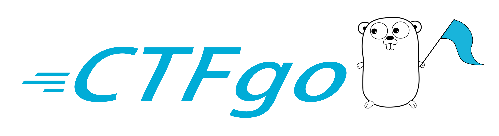

# CTFgo - CTF Platform written in Golang

A Golang CTF Platform with high concurrency, security, and low hardware requirements.

## What is CTFgo?

## Features

## Installation

## CTFgo Development Team

| [ <b>Leonsec</b>](https://github.com/Le0nsec)  | [ <b>Am473ur</b>](https://github.com/Am473ur)  | [ <b>Angle-z</b>](https://github.com/angle-z)   | [ <b>Soreat_u</b>](https://github.com/soreatu)  
| :---: | :---: | :---: | :---: |
